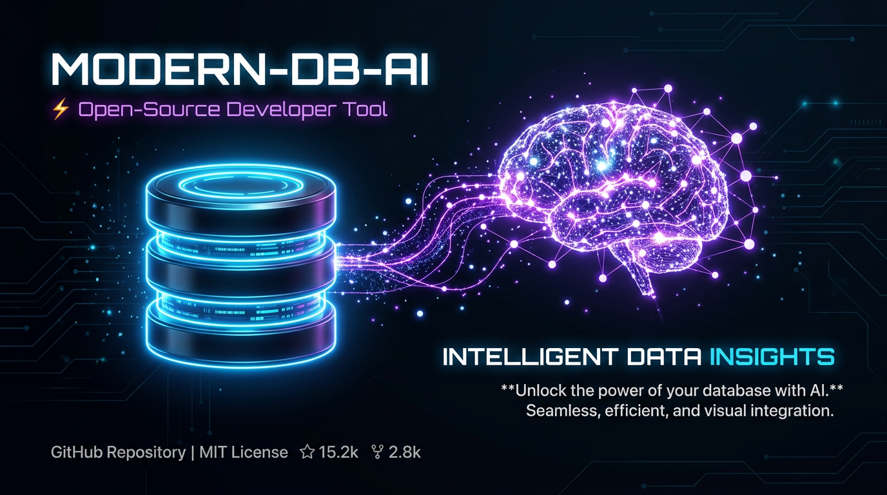

<div align="center">
  

  # 🛠️ Query Studio

  <p align="center">
    <strong>A powerful, AI-driven database tool that bridges the gap between natural language and SQL.</strong>
  </p>

  <p align="center">
    <a href="https://tauri.app/">
      
    </a>
    <a href="https://vuejs.org/">
      
    </a>
    <a href="https://www.typescriptlang.org/">
      
    </a>
    <a href="https://tailwindcss.com/">
      
    </a>
    <a href="https://rust-lang.org/">
      
    </a>
  </p>
</div>

---

## 🌟 Overview

**Query Studio** offers a seamless native experience for managing and querying your databases. Stop wrestling with complex SQL syntax—simply describe what you want in plain English, and let our integrated AI engine generate, explain, and execute the exact query you need.

## ✨ Features

- **🗣️ AI-Powered Query Generation**: Leveraging Google's **Gemini Pro**, describe your data needs (e.g., *"Find all users who signed up last week and spent over $500"*), and Query Studio instantly crafts the precise SQL.
- **🔌 Multi-Database Support**: Connect effortlessly to **PostgreSQL**, **MySQL**, **SQLite**, and **MSSQL**.
- **🧠 Logic Breakdown**: Don't just copy-paste code. Query Studio provides a step-by-step plain-English explanation of the generated SQL logic.
- **⚡️ Real-Time Execution**: Run queries instantly and view your results in a responsive, sortable, and beautifully formatted data table.
- **🔒 Secure Connections**: Your database credentials stay yours. Connections are stored and managed locally and securely.
- **🌙 Developer-First UI**: A sleek, modern, dark-mode-first interface designed for extended focus and high productivity.

## 🛠️ Tech Stack

Query Studio is built using a modern, high-performance stack:

- **Frontend**: [Vue 3](https://vuejs.org/) + [TypeScript](https://www.typescriptlang.org/) + [Tailwind CSS](https://tailwindcss.com/)
- **Backend/Core**: [Rust](https://rust-lang.org/) powered by [Tauri](https://tauri.app/)
- **AI Engine**: Google Gemini Pro (via Genkit or direct API integration)

## 🚀 Getting Started

Follow these steps to get a local development environment up and running.

### Prerequisites

Ensure you have the following installed on your machine:
- **[Node.js](https://nodejs.org/)** (v18 or higher)
- **[Rust & Cargo](https://rustup.rs/)** (Required for Tauri native bindings)

### Installation

1. **Clone the repository**
   ```bash
   git clone https://github.com/iamEtornam/db-lang.git
   cd db-lang
   ```

2. **Install dependencies**
   ```bash
   npm install
   ```

### Running the App

To run the application in development mode with hot-reloading enabled for both the frontend and the Rust backend:

```bash
npm run tauri dev
```

This command will spin up the Vite development server and launch the native Tauri window.

## 🤝 Contributing

Contributions, issues, and feature requests are welcome! Feel free to check the [issues page](https://github.com/iamEtornam/db-lang/issues) if you want to contribute.

## 📄 License

This project is open-source and available under the [MIT License](LICENSE).
